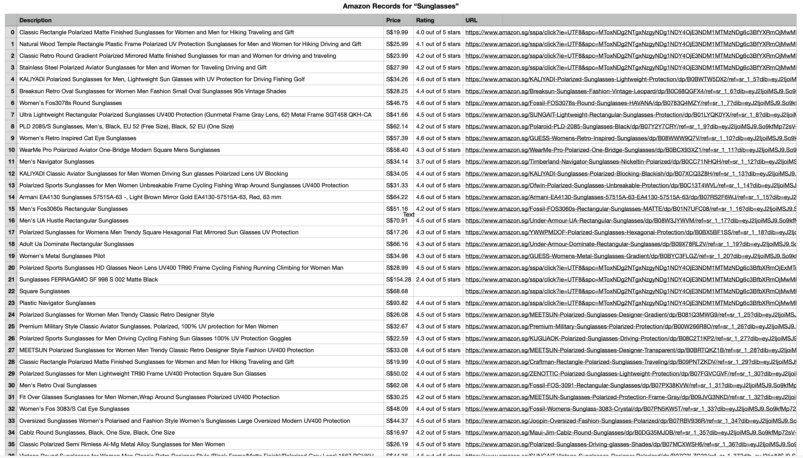

# Amazon Web Scraping

This project aims to extract information from the Amazon website such as the product item title, the price, the rating and the URL. 

## Situation

Scrolling for hours and hours to find the best product in Amazon could be time consuming and exhausting.  
Also, items comes and goes.

What could be an efficient way to facilitate the comparison between each product such as the price or the rating ? 

## Task

Extracting information from the Amazon website and store the data. 

## Actions

<ins>Extracting the information from a specific product with the following steps:</ins>

    1 - Lunching the webdriver (browser used for the going to the website)
    2 - Going to the main website
    3 - Typing the keyword in the searchbar and entering to the 8 first pages
    4 - Extract the HTML code with every href from every product item
    5 - Going to every product item website
    6 - Extracting the information (description, price, rating, URL)
    7 - Collect the information in a list
    8 - Close the webdriver

## Results

The item products are stored in a table as you can see above which facilitate the comparison on the price or the rating.